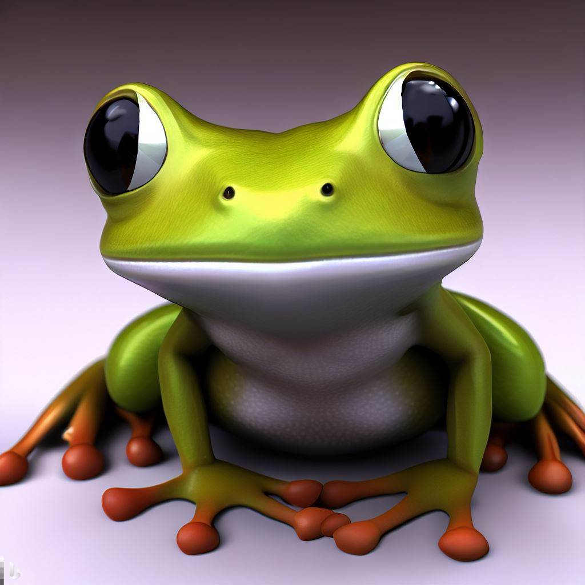
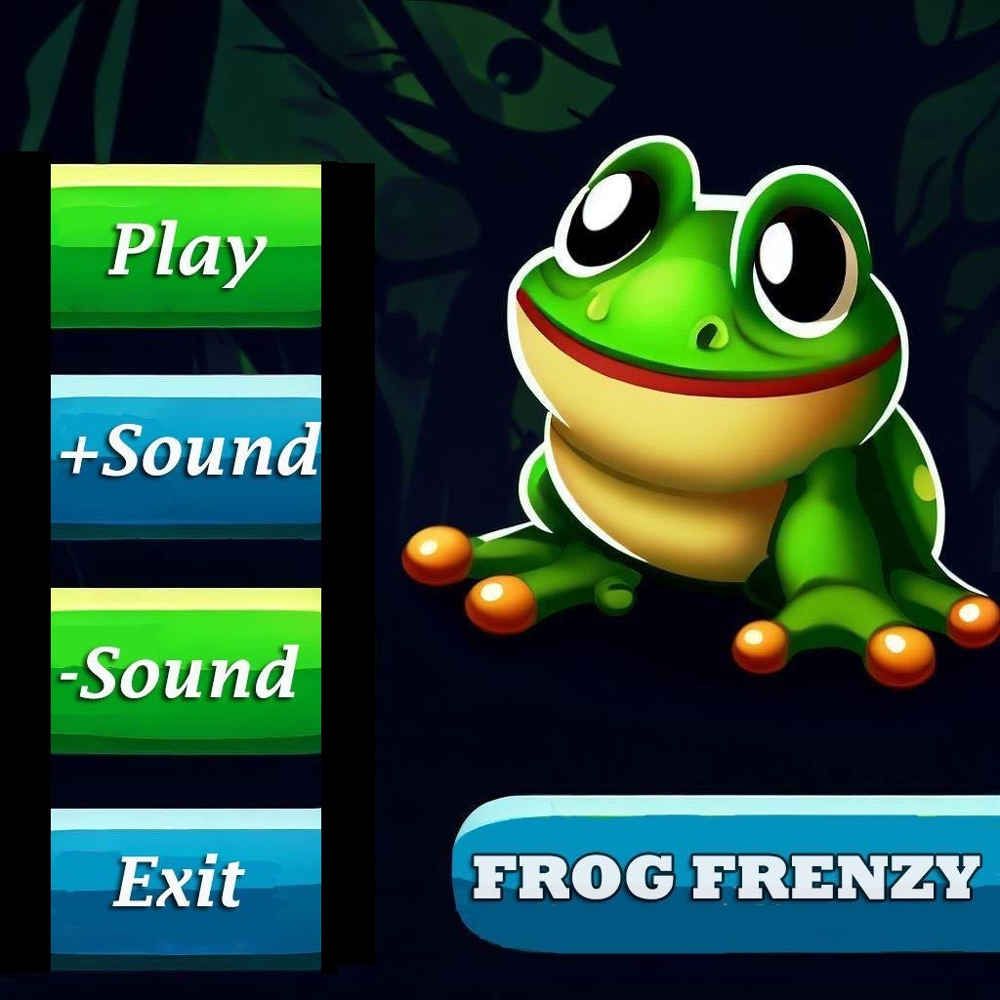
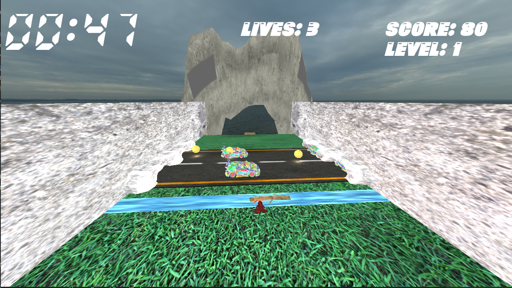
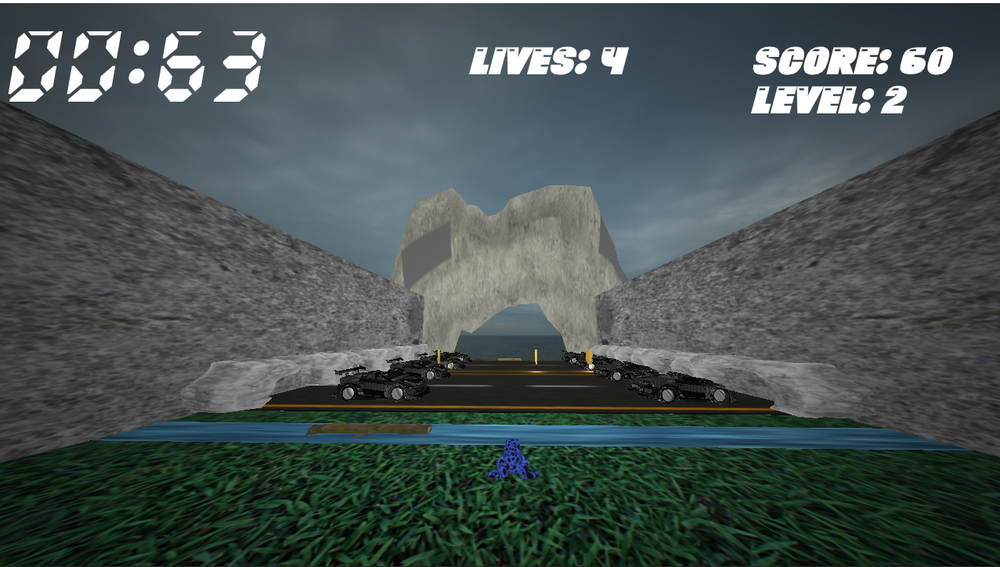
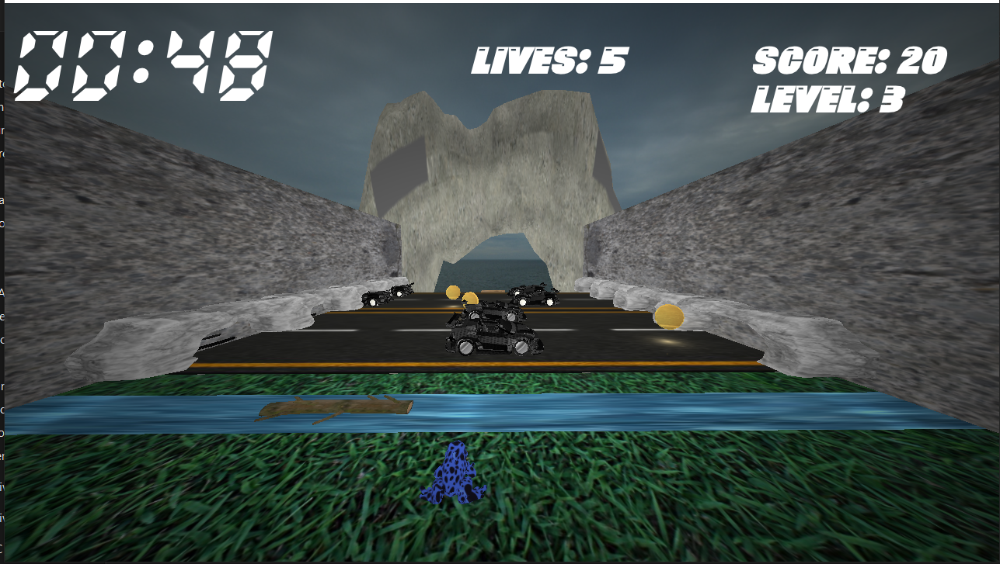
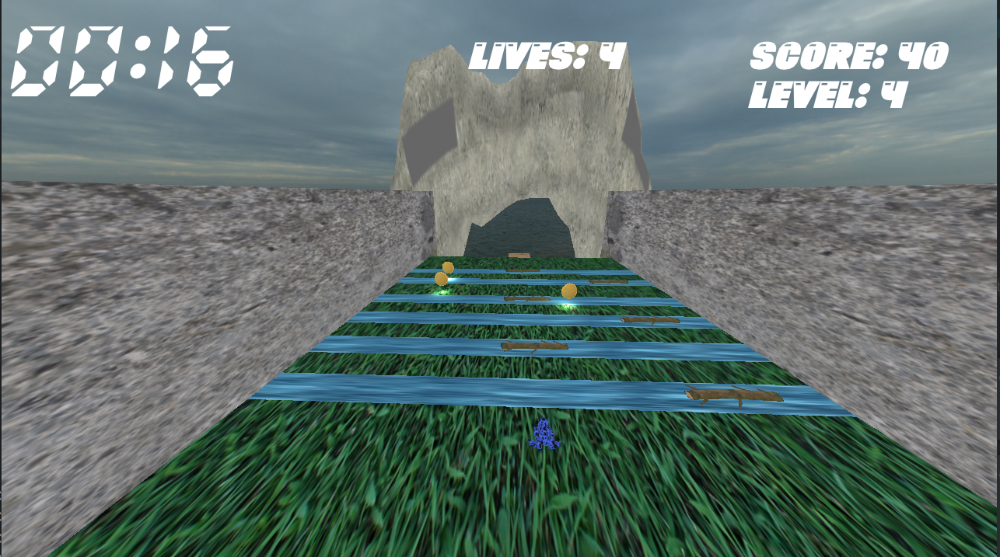
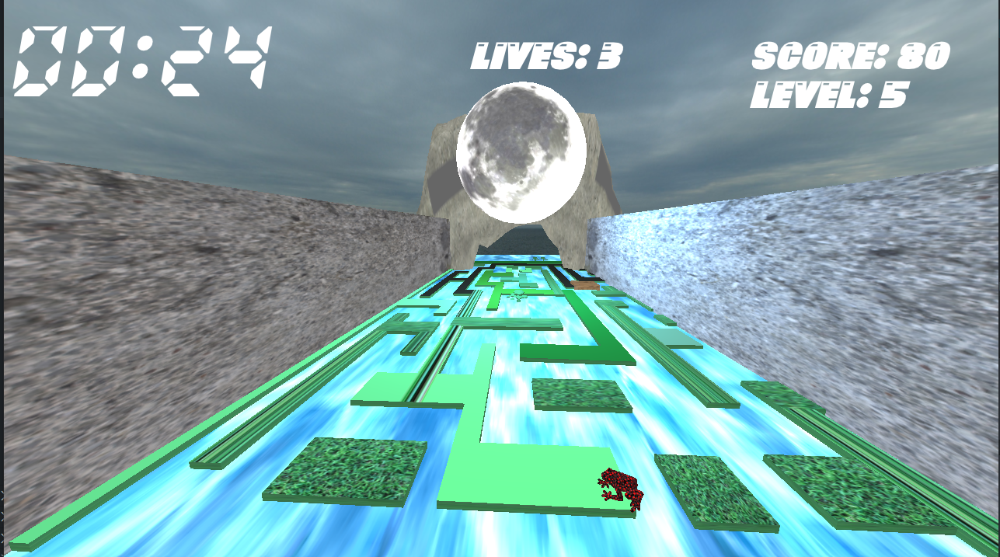
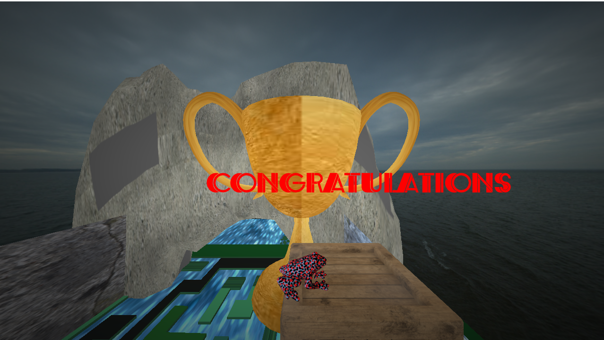

<div align="center">

</div>

<div align="center">

[](https://github.com/ZeyadTarekk/Frog-Frenzy/contributors)
[](https://github.com/ZeyadTarekk/Frog-Frenzy/issues)
[](https://github.com/ZeyadTarekk/Frog-Frenzy/blob/master/LICENSE)
[](https://github.com/ZeyadTarekk/Frog-Frenzy/network)
[](https://github.com/ZeyadTarekk/Frog-Frenzy/stargazers)
[](https://img.shields.io/github/languages/count/ZeyadTarekk/Frog-Frenzy)

</div>

## 📝 Table of Contents

- [📝 Table of Contents](#-table-of-contents)
- [📙 About ](#-about-)
- [🌠 Features ](#-features-)
- [📂 Folder Structure ](#-folder-structure-)
- [🏁 Getting Started ](#-getting-started-)
  - [Prerequisite ](#prerequisite-)
  - [Installation ](#installation-)
  - [Running ](#running-)
- [💻 Built Using ](#-built-using-)
- [📸 Demo Screens ](#-demo-screens-)
- [🎥 Demo Videos ](#-demo-videos-)
- [🕴 Contributors ](#-contributors-)
- [📃 License ](#-license-)

## 📙 About <a name = "about"></a>

3D Frog Frenzy is an exciting  game that puts the player in control of a frog within a vibrant 3D environment. The objective of the game is to navigate through a series of challenging levels, collecting coins while avoiding various obstacles and hazards.


## 🌠 Features <a name= "features"></a>
1. 3D Environment: The game takes place in a visually appealing 3D environment, providing an immersive and engaging experience for players.

2. Maze-Like Levels: The game offers a series of maze-like levels filled with obstacles, hazards, and coins to collect, presenting a challenge that requires strategic navigation and problem-solving skills.

3. Collision System: The game incorporates a collision system that allows the frog character to interact with the environment, avoiding obstacles and detecting collisions with other objects.

3. Movement Controls: Players can control the movement of the frog using arrow keys, enabling precise and responsive maneuvering through the levels.

3. Level Ups: As players progress, they encounter increasingly challenging levels that test their skills and require quick reflexes and careful planning to overcome obstacles and reach the next level.

4. Menu System: The game features an intuitive menu system that allows players to start the game, access game options, and navigate through different game states.

5. End Game State: The game provides a satisfying end game state that reflects the player's performance, displaying their score and achievements.

6. Coins and Power-ups: Throughout the levels, players can collect coins to increase their score and unlock power-ups, adding an element of strategy and enhancing gameplay.

7. Lives and Hearts: Players start with a set number of lives, which can be replenished by collecting hearts scattered throughout the levels, allowing for extended gameplay and additional chances to overcome challenges.

8. Timer: A timer adds a time pressure element to the gameplay, requiring players to complete levels within a specified time limit, adding excitement and a sense of urgency.


## 📂 Folder Structure <a name= "folder-structure"></a>

```sh
├───assets
│   ├───audios
│   ├───fonts
│   ├───images
│   │   ├───ground
│   │   ├───metal
│   │   └───suzanne
│   ├───models
│   ├───shaders
│   │   └───postprocess
│   └───textures
│       └───rockTextures
├───config
│   ├───entity-test
│   ├───material-test
│   ├───mesh-test
│   ├───pipeline-test
│   ├───postprocess-test
│   ├───renderer-test
│   ├───sampler-test
│   ├───shader-test
│   ├───sky-test
│   ├───texture-test
│   └───transform-test
├───scripts
├───source
│   ├───common
│   │   ├───components
│   │   ├───ecs
│   │   ├───input
│   │   ├───material
│   │   ├───mesh
│   │   ├───shader
│   │   ├───systems
│   │   └───texture
│   └───states
└───vendor
    ├───glad
    │   ├───include
    │   │   ├───glad
    │   │   └───KHR
    │   └───src
    ├───glfw
    │   ├───CMake
    │   │   └───modules
    │   ├───deps
    │   │   ├───glad
    │   │   ├───mingw
    │   │   └───vs2008
    │   ├───include
    │   │   └───GLFW
    │   └───src
    ├───glm
    │   └───glm
    │       ├───detail
    │       ├───ext
    │       ├───gtc
    │       ├───gtx
    │       └───simd
    ├───imgui
    │   └───imgui_impl
    ├───irrklang
    │   ├───dlls
    │   │   └───winx64-visualStudio
    │   ├───include
    │   └───lib
    │       └───Winx64-visualStudio
    └───utils
        ├───flags
        ├───json
        ├───stb
        ├───tinygltf
        └───tinyobj

```
## 🏁 Getting Started <a name = "get-started"></a>

> This is an list of needed instructions to set up your project locally, to get a local copy up and running follow these
> instructuins.

### Prerequisite <a name = "req"></a>

1. C++ Compiler 
   1. Clang
   2. GCC (GNU Compiler Collection)
2. CMake
3. Integrated Development Environments (IDEs)
   1. Visual Studio Code (VS Code)
   2. CLion
   3. Visual Studio (VS)  

### Installation <a name = "Install"></a>

1. **_Clone the repository_**

```sh
$ git clone https://github.com/ZeyadTarekk/Frog-Frenzy.git
```

2. **_Navigate to Frog-Frenzy_**

```sh
$ cd Frog-Frenzy
```

### Running <a name = "running"></a>

**_Running program_**

1. **__Build projects__**


2. **_Start program_**
```sh
.\bin\GAME_APPLICATION.exe 
```
## 💻 Built Using <a name = "tech"></a>

- **C++**
- **GlFW**
- **Glad**
- **imgui**
- **IrrKlang**

## 📸 Demo Screens <a name = "screens"></a>

<div align="center">
<h3 align='left'>Menu</h3>
   
<h3 align='left'>Level 1</h3>
   

<h3 align='left'>Level 2</h3>

<h3 align='left'>Level 3</h3>

<h3 align='left'>Level 4</h3>

<h3 align='left'>Level 5</h3>

<h3 align='left'>Winning</h3>



</div>

## 🎥 Demo Videos <a name = "videos"></a>

<div align="center">


https://github.com/ZeyadTarekk/Frog-Frenzy/assets/76125650/a96ebed4-503c-431c-a3e6-6240bb8c803f


</div>

## 🕴 Contributors <a name = "Contributors"></a>

<table>
  <tr>
    <td align="center">
    <a href="https://github.com/ZiadSheriif" target="_black">
    
    <br />
    <sub><b>Ziad Sherif</b></sub></a>
    </td>
     <td align="center">
    <a href="https://github.com/ZeyadTarekk" target="_black">
    
    <br />
    <sub><b>Zeyad Tarek</b></sub></a>
    </td>
       <td align="center">
    <a href="https://github.com/waleedhesham446" target="_black">
    
    <br />
    <sub><b>Waleed Hesham</b></sub></a>
    </td>
       <td align="center">
    <a href="https://github.com/abdalhamedemad" target="_black">
    
    <br />
    <sub><b>Abdelhamid Emad</b></sub></a>
    </td>
    
    
  </tr>
 </table>


## 📃 License <a name = "license"></a>

> This software is licensed under MIT License, See [License](https://github.com/https://github.com/ZeyadTarekk/Frog-Frenzy/blob/main/LICENSE) for more information ©Frog-Frenzy.
